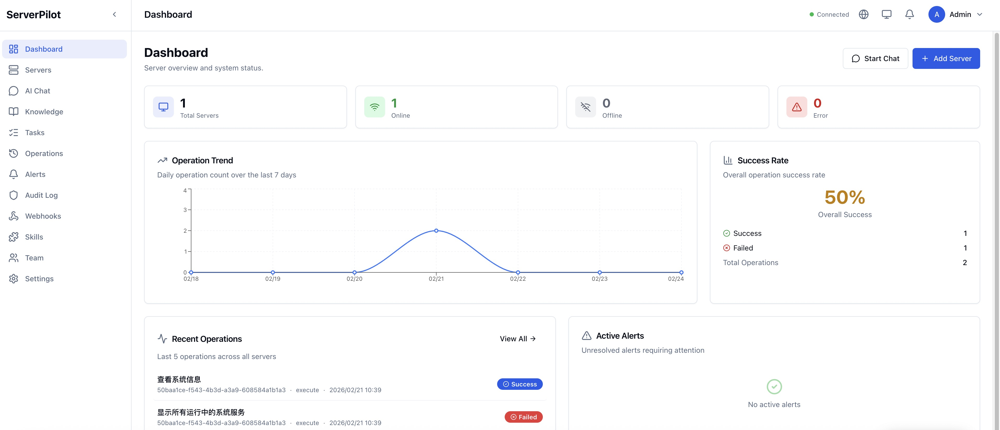

<h1 align="center">🚀 ServerPilot</h1>

<p align="center">
  <strong>AI 驱动的服务器管理平台</strong>
</p>

<p align="center">
  跟 AI 聊天就能管服务器 — 开源、安全、自主可控
</p>

<p align="center">
  <a href="README.md">English</a> •
  <a href="#快速开始">快速开始</a> •
  <a href="#文档">文档</a> •
  <a href="#参与贡献">参与贡献</a>
</p>

<p align="center">
  <a href="https://github.com/jingyus/serverpilot/actions/workflows/ci.yml"></a>
  <a href="https://github.com/jingyus/serverpilot/actions/workflows/test.yml"></a>
  <a href="https://github.com/jingyus/serverpilot/actions/workflows/docker-publish.yml"></a>
  <a href="https://www.gnu.org/licenses/agpl-3.0"></a>
  <a href="https://github.com/jingyus/serverpilot/releases"></a>
  <a href="https://github.com/jingyus/serverpilot/stargazers"></a>
</p>

---

## ServerPilot 是什么?

**ServerPilot** 是宝塔面板的 AI 时代替代品。同样一行命令安装,但用 AI 对话取代表单点击,用开源透明取代闭源黑盒。

```
传统运维:    用户 → 写脚本/敲命令/点面板 → 服务器
ServerPilot: 用户 → 对话 AI → 生成计划 → 用户确认 → Agent 执行 → 结果反馈
```

**核心价值**: 用自然语言管理服务器,AI 理解你的意图并安全执行,无需记忆复杂命令。

---

<p align="center">
  
</p>

<p align="center">
  <em>Dashboard 概览 - 服务器监控、操作趋势、实时告警</em>
</p>

---

## ✨ 功能特性

### 🤖 AI 对话运维
- **自然语言交互** — 用自然语言描述需求,AI 自动生成执行计划并完成操作
- **多 AI 模型支持** — 兼容 Claude、OpenAI、DeepSeek、Ollama 或任何 Custom OpenAI 兼容接口 (OneAPI / LiteLLM / Azure)
- **上下文感知** — AI 记住每台服务器的环境、软件、配置,上下文精准不出错
- **知识库自成长** — 内置常见技术栈文档(Nginx、MySQL、Docker、Node.js 等),支持从 GitHub/官网自动更新

### 🛡️ 企业级安全
- **五级安全防护** — 命令分级审核 + 参数审计 + 操作快照 + 紧急终止 + 完整审计日志
- **726+ 安全规则** — 将命令分为 5 个风险等级(GREEN/YELLOW/RED/CRITICAL/FORBIDDEN)
- **45+ 参数模式** — 自动识别危险参数和受保护路径
- **完整审计日志** — 记录每个操作的用户、时间戳、风险级别和结果

### 📊 实时监控
- **实时指标** — CPU、内存、磁盘、网络监控,SSE 流式推送
- **即时告警** — Webhook 通知任务完成、服务器离线、操作失败等事件
- **交互式仪表板** — 实时图表和历史趋势分析

### 🪶 轻量高效
- **最小占用** — 单一二进制 Agent(<50MB, <1% CPU 占用)
- **零配置部署** — 开箱即用,仅在需要时自定义
- **跨平台支持** — 支持 linux/amd64 和 linux/arm64 架构

## 🏗️ 架构总览

```
┌─────────────────────────────────────────────────────────────────┐
│                        Web Dashboard                            │
│              React + Vite + Tailwind CSS + Zustand              │
│         服务器列表 · AI 对话 · 实时监控 · 知识库搜索              │
└───────────────────────────┬─────────────────────────────────────┘
                            │ REST API + SSE 流式响应
┌───────────────────────────┴─────────────────────────────────────┐
│                          Server                                  │
│                    Node.js + Hono + SQLite                       │
│  ┌──────────┐ ┌──────────┐ ┌──────────┐ ┌────────────────────┐  │
│  │ AI 引擎   │ │ API 服务  │ │ 知识库    │ │ 安全 · 审计 · 监控  │  │
│  │(多模型)   │ │(REST+WS) │ │(RAG)     │ │(五级命令分级)       │  │
│  └──────────┘ └──────────┘ └──────────┘ └────────────────────┘  │
└───────────────────────────┬─────────────────────────────────────┘
                            │ WSS 加密长连接
          ┌─────────────────┼─────────────────┐
          │                 │                 │
    ┌─────┴─────┐     ┌─────┴─────┐    ┌─────┴─────┐
    │  Agent A   │     │  Agent B   │    │  Agent C   │
    │ 生产服务器  │     │ 测试服务器  │    │ 开发机     │
    │            │     │            │    │            │
    │ · 环境探测  │     │ · 环境探测  │    │ · 环境探测  │
    │ · 命令执行  │     │ · 命令执行  │    │ · 命令执行  │
    │ · 安全沙箱  │     │ · 安全沙箱  │    │ · 安全沙箱  │
    │ · 指标上报  │     │ · 指标上报  │    │ · 指标上报  │
    └───────────┘     └───────────┘    └───────────┘
```

## 🚀 快速开始

### 方式一: Docker 部署(推荐)

使用预构建镜像,无需克隆代码,无需本地编译:

```bash
# 1. 下载配置文件
curl -fsSL https://raw.githubusercontent.com/jingyus/serverpilot/master/docker-compose.yml -o docker-compose.yml
curl -fsSL https://raw.githubusercontent.com/jingyus/serverpilot/master/.env.example -o .env

# 2. 编辑 .env 配置(至少设置 JWT_SECRET 和 AI Provider)
#    JWT_SECRET=your-secret-key-at-least-32-chars
#    AI_PROVIDER=claude
#    ANTHROPIC_API_KEY=sk-ant-...

# 3. 拉取镜像并启动
docker compose pull && docker compose up -d

# 4. 打开浏览器
#    Dashboard: http://localhost:3001
#    API 文档:  http://localhost:3001/api-docs
```

查看自动生成的管理员密码:

```bash
docker compose logs server | grep -i "password"
```

### 方式二: 从源码构建

```bash
# 1. 克隆仓库
git clone https://github.com/jingyus/serverpilot.git
cd ServerPilot

# 2. 从源码构建并启动
docker compose -f docker-compose.yml -f docker-compose.build.yml up -d --build

# 3. 打开浏览器访问 http://localhost:3001
```

如需配置 AI 功能,运行引导式初始化:

```bash
./init.sh
```

### 方式三: 本地开发

```bash
# 安装依赖
pnpm install

# 开发模式(热重载)
pnpm dev

# 运行测试
pnpm test

# 构建 Agent 二进制
bun scripts/build-binary.ts
```

## 🐳 Docker 镜像

镜像发布到 GitHub Container Registry (GHCR),支持 `linux/amd64` 和 `linux/arm64` 架构。

```bash
docker pull ghcr.io/jingyus/serverpilot/server:latest
docker pull ghcr.io/jingyus/serverpilot/agent:latest
docker pull ghcr.io/jingyus/serverpilot/dashboard:latest
```

**版本标签说明:**

| 标签格式 | 示例 | 说明 |
|---------|------|------|
| `latest` | `ghcr.io/jingyus/serverpilot/server:latest` | 最新的 main 分支构建 |
| `{version}` | `ghcr.io/jingyus/serverpilot/server:0.1.0` | 语义化版本(推荐生产使用) |
| `{major}.{minor}` | `ghcr.io/jingyus/serverpilot/server:0.1` | 主次版本号 |
| `sha-{hash}` | `ghcr.io/jingyus/serverpilot/server:sha-a1b2c3d` | Git commit hash |

## 🎨 AI Provider 配置

ServerPilot 支持多种 AI 模型提供商,通过环境变量选择:

| Provider | 环境变量 | 说明 |
|----------|---------|------|
| **Claude**(默认) | `AI_PROVIDER=claude`<br/>`ANTHROPIC_API_KEY=sk-...` | Anthropic Claude(Tier 1,推荐) |
| **OpenAI** | `AI_PROVIDER=openai`<br/>`OPENAI_API_KEY=sk-...` | GPT-4o 等(Tier 2) |
| **DeepSeek** | `AI_PROVIDER=deepseek`<br/>`DEEPSEEK_API_KEY=sk-...` | DeepSeek Chat(Tier 2) |
| **Ollama** | `AI_PROVIDER=ollama` | 本地模型(Tier 3,无需 API Key) |
| **Custom OpenAI** | `AI_PROVIDER=custom-openai` | 任何 OpenAI 兼容接口 |

**Custom OpenAI 兼容接口**(OneAPI / LiteLLM / Azure OpenAI):

```bash
AI_PROVIDER=custom-openai
CUSTOM_OPENAI_API_KEY=sk-your-api-key
CUSTOM_OPENAI_BASE_URL=https://your-api.example.com/v1
AI_MODEL=gpt-4o  # 可选: 按你的服务支持的模型名
```

也可以在 Dashboard 的设置页面中动态切换 Provider,无需重启服务。

## 🛠️ 技术栈

| 组件 | 技术 | 许可证 |
|------|------|--------|
| **Server** | Node.js 22+, TypeScript, Hono, Drizzle ORM, SQLite, Claude SDK | AGPL-3.0 |
| **Agent** | TypeScript, Bun(编译为单一二进制) | Apache-2.0 |
| **Dashboard** | React 18, Vite 5, Tailwind CSS, Zustand, React Router 6 | AGPL-3.0 |
| **Shared** | Zod 协议验证 | MIT |
| **AI Provider** | Claude / OpenAI / DeepSeek / Ollama / Custom OpenAI 兼容 | - |
| **部署** | Docker Compose, GitHub Actions CI/CD | - |

## 📊 与其他工具对比

| 特性 | ServerPilot | 宝塔面板 | Ansible | Portainer |
|------|:-----------:|:-------:|:-------:|:---------:|
| AI 对话运维 | ✅ | ❌ | ❌ | ❌ |
| 无需学习命令 | ✅ | ✅ | ❌ | ✅ |
| 开源透明 | ✅ | ❌ | ✅ | 部分 |
| 轻量 Agent | ✅ | ❌ | 无 Agent | ❌ |
| 五级安全审计 | ✅ | 基础 | 无 | 无 |
| 知识库 RAG | ✅ | ❌ | ❌ | ❌ |
| 上下文感知 AI | ✅ | 基础信息 | Inventory | 基础 |
| 自带 AI Key | ✅ | ❌ | ❌ | ❌ |
| 本地模型支持 | ✅(Ollama) | ❌ | ❌ | ❌ |

## 💰 定价

**ServerPilot 社区版 100% 开源,永久免费。**

- ✅ **所有核心功能完整可用** — 多服务器管理、团队协作、Webhook、实时监控
- ✅ **无功能限制** — 无试用期、无付费墙、无人为限制
- ✅ **自主部署在您的基础设施上** — 完全掌控数据和部署
- ⚙️ **自带 AI API Key** — 使用 Claude、OpenAI、DeepSeek、Ollama 或任何 OpenAI 兼容接口
- 🔓 **无供应商锁定** — 标准 SQLite 数据库、Docker 部署、开放协议

> 💡 **未来计划**: 我们正在考虑推出托管云版本,面向不想管理基础设施的用户。云版本将包含官方 AI Key、自动备份和企业功能(SAML SSO、合规报告),但自部署的社区版将始终保持功能完整且免费。

## 🗺️ 项目路线图

| 阶段 | 目标 | 状态 |
|------|------|------|
| **MVP(v0.1)** | 自部署 → 安装 Agent → 连接 → 对话运维 闭环 | ✅ 已完成 |
| **v0.2** | 快照回滚 + 定时任务 + 高级告警 + 知识库自学习 | 🚧 进行中 |
| **v0.3** | 社区安装脚本 + 插件系统 + API 扩展 | 📋 计划中 |
| **v1.0** | 稳定 API + 生产就绪 + 可选托管云服务 | 📋 计划中 |

## 📚 文档

| 文档 | 说明 |
|------|------|
| [Architecture](docs/ARCHITECTURE.md) | 系统架构、模块职责、数据流、通信协议 |
| [Security White Paper](docs/SECURITY.md) | 五层纵深防御架构详细说明 |
| [Security Policy](SECURITY.md) | 漏洞报告流程和安全策略 |
| [Deployment Guide](docs/deployment.md) | Docker Compose 部署指南 |
| [API Documentation](http://localhost:3001/api-docs) | OpenAPI 3.0 规范 + Swagger UI(服务运行时) |

## 🔒 安全

ServerPilot 采用**五层纵深防御**策略保护你的服务器:

1. **命令分级** — 726+ 条规则,5 个风险等级(GREEN / YELLOW / RED / CRITICAL / FORBIDDEN)
2. **参数审计** — 45+ 危险参数模式,40+ 保护路径
3. **操作快照** — 关键操作前自动创建回滚点
4. **紧急终止** — 一键停止所有运行中的操作
5. **审计日志** — 完整的操作追踪和可审计记录

Agent 以非 root 用户运行,仅经审批的操作获得提权。详见 [Security White Paper](docs/SECURITY.md) 和 [Security Policy](SECURITY.md)。

## 🤝 参与贡献

欢迎提交 Issue 和 Pull Request!

```bash
# Fork 并克隆仓库
git clone https://github.com/your-username/ServerPilot.git
cd ServerPilot

# 安装依赖
pnpm install

# 开发模式
pnpm dev

# 运行测试
pnpm test

# 提交 PR 前确保通过
pnpm lint && pnpm typecheck && pnpm test
```

详细贡献指南请参考项目中的贡献文档。

## 📄 许可证

ServerPilot 采用 **Open Core** 模式:

| 组件 | 许可证 | 说明 |
|------|--------|------|
| **Server + Dashboard**(CE) | [AGPL-3.0](LICENSE) | 开源核心,限制云服务商直接使用 |
| **Agent** | [Apache-2.0](packages/agent/LICENSE) | 企业友好,100% 开源可审计 |
| **Shared** | [MIT](packages/shared/LICENSE) | 最大生态兼容性 |

详细策略见 [LICENSING.md](LICENSING.md)。

## 🙏 致谢

感谢以下开源项目:
- [Anthropic Claude](https://www.anthropic.com/) — AI 提供商
- [Hono](https://hono.dev/) — 超快 Web 框架
- [Drizzle ORM](https://orm.drizzle.team/) — TypeScript ORM
- [Bun](https://bun.sh/) — 快速 JavaScript 运行时
- [Vite](https://vitejs.dev/) — 下一代前端工具

## 📬 联系与支持

- **GitHub Issues**: [报告问题或请求新功能](https://github.com/jingyus/serverpilot/issues)
- **文档**: [docs/](docs/)
- **安全**: 查看 [SECURITY.md](SECURITY.md) 了解漏洞报告流程

---

<p align="center">
  如果 ServerPilot 对你有帮助,请点个 Star ⭐ 支持一下,让更多人发现这个项目!
</p>

<p align="center">
  <a href="https://star-history.com/#jingyus/serverpilot&Date">
    
  </a>
</p>

<p align="center">
  <sub>Built with ❤️ by the ServerPilot team</sub>
</p>
